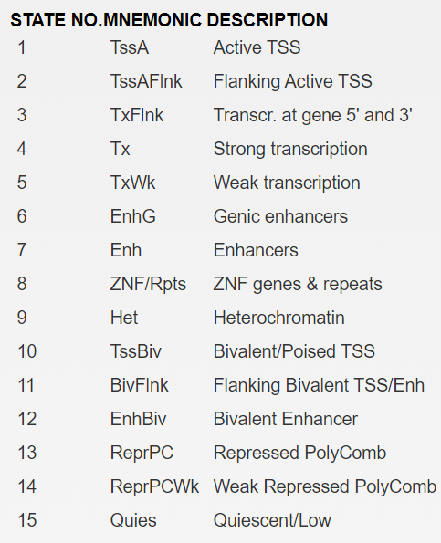
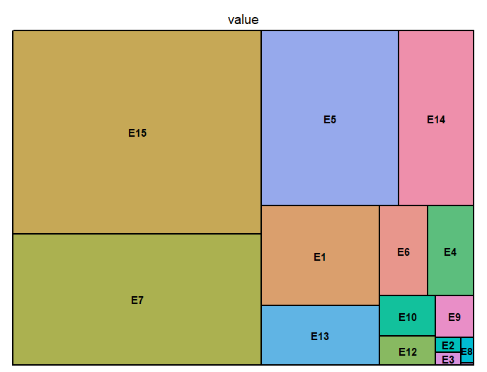
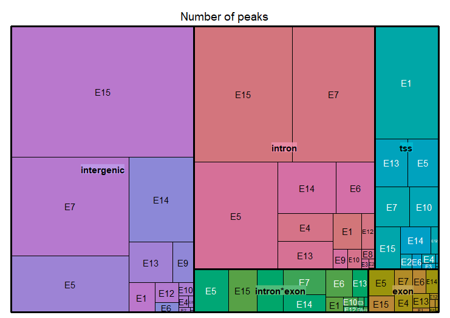

# 野生型 Zfp148 peaks ChromHMM分类和kmeans聚类分析汇总

## ChromHMM x15
-----

15个 Chromatin state，意义如下：

### 汇总结果

#### 直接分类

计数表

| state | count |
|-------|-------|
| E1    | 3182  |
| E10   | 608   |
| E11   | 6     |
| E12   | 436   |
| E13   | 1891  |
| E14   | 3521  |
| E15   | 13578 |
| E2    | 106   |
| E3    | 87    |
| E4    | 1111  |
| E5    | 6515  |
| E6    | 1156  |
| E7    | 8759  |
| E8    | 86    |
| E9    | 422   |

计数分布treemap

#### 区域位置细分

细分计数表

| location     | state | count |
|--------------|-------|-------|
| intergenic   | E1    | 261   |
| intergenic   | E10   | 66    |
| intergenic   | E11   | 2     |
| intergenic   | E12   | 160   |
| intergenic   | E13   | 610   |
| intergenic   | E14   | 1874  |
| intergenic   | E15   | 8100  |
| intergenic   | E2    | 19    |
| intergenic   | E3    | 4     |
| intergenic   | E4    | 40    |
| intergenic   | E5    | 2241  |
| intergenic   | E6    | 76    |
| intergenic   | E7    | 3951  |
| intergenic   | E8    | 21    |
| intergenic   | E9    | 296   |
| intron       | E1    | 356   |
| intron       | E10   | 91    |
| intron       | E11   | 2     |
| intron       | E12   | 157   |
| intron       | E13   | 515   |
| intron       | E14   | 1012  |
| intron       | E15   | 4536  |
| intron       | E2    | 18    |
| intron       | E3    | 27    |
| intron       | E4    | 526   |
| intron       | E5    | 3039  |
| intron       | E6    | 666   |
| intron       | E7    | 3815  |
| intron       | E8    | 42    |
| intron       | E9    | 99    |
| exon         | E1    | 26    |
| exon         | E10   | 14    |
| exon         | E12   | 17    |
| exon         | E13   | 82    |
| exon         | E14   | 102   |
| exon         | E15   | 148   |
| exon         | E2    | 1     |
| exon         | E3    | 10    |
| exon         | E4    | 123   |
| exon         | E5    | 239   |
| exon         | E6    | 111   |
| exon         | E7    | 147   |
| exon         | E8    | 9     |
| exon         | E9    | 4     |
| tss          | E1    | 2448  |
| tss          | E10   | 394   |
| tss          | E11   | 2     |
| tss          | E12   | 71    |
| tss          | E13   | 534   |
| tss          | E14   | 280   |
| tss          | E15   | 370   |
| tss          | E2    | 60    |
| tss          | E3    | 26    |
| tss          | E4    | 44    |
| tss          | E5    | 492   |
| tss          | E6    | 51    |
| tss          | E7    | 474   |
| tss          | E8    | 4     |
| tss          | E9    | 9     |
| intron\*exon | E1    | 91    |
| intron\*exon | E10   | 43    |
| intron\*exon | E12   | 31    |
| intron\*exon | E13   | 150   |
| intron\*exon | E14   | 253   |
| intron\*exon | E15   | 424   |
| intron\*exon | E2    | 8     |
| intron\*exon | E3    | 20    |
| intron\*exon | E4    | 378   |
| intron\*exon | E5    | 504   |
| intron\*exon | E6    | 252   |
| intron\*exon | E7    | 372   |
| intron\*exon | E8    | 10    |
| intron\*exon | E9    | 14    |

细分treemap

### 热图

## kmeans x4

